# DeepSeek Harness 手机版（Android）

> 把 DeepSeek Harness（DSH）打包成**可直接安装的 Android APK** —— 装上就能用，还能让 AI **免 Root 真正操作手机**。


## ✨ 核心亮点

- 📦 **APK 一键安装**：不用 Termux、不用敲命令，下载安装即用（包名 `com.deepseek.harness`）
- 🔓 **免 Root 系统特权**：通过 Shizuku 打通系统 shell —— AI 能**装应用、点屏幕、改系统设置、截图、模拟输入**，这是"手机上的 AI Agent"，不只是聊天窗口
- 🟢 **可选特权，不授予也能正常用**（v1.4.0）：不装 Shizuku/无 root 也能用——文件读写、预览、编辑只需「所有文件访问」权限；未授权时 AI 不会反复尝试系统操作，需要时会**引导你授权**
- 🔀 **Root 优先，Shizuku 备用**（v1.4.0）：有 root 走 su 通道，无 root 走 Shizuku，自动选择
- ⏰ **前台保活**（v1.4.0）：AI 干活时挂后台/锁屏不被杀，任务完成推送通知
- 🔔 **AI 发通知**（v1.4.0）：只需通知权限，任务完成/需要关注时推送到通知栏
- 🧠 **完整 DSH 内核**：`@deepseek-ai/dsh` 0.1.0-rc.6，保留插件生态 + RPC API，前端用 DSH 原生界面
- 📱 **移动端适配**：触摸优化 + 软键盘适配 + 首次启动权限引导页（9 项权限一站式配置）
- 💾 **卸载不丢数据**：dshroot 外置到 `/sdcard/DeepSeekHarness`，重装/升级不清空 AI 的运行时改动
- 🐋 鲸鱼品牌图标，横竖屏自由旋转

## 📸 界面预览

> 截图于 v1.2.0（2026-08-17）与 v1.4.0（2026-08-20），完整文件见 `docs/screenshots/`。

| | | |
|---|---|---|
| 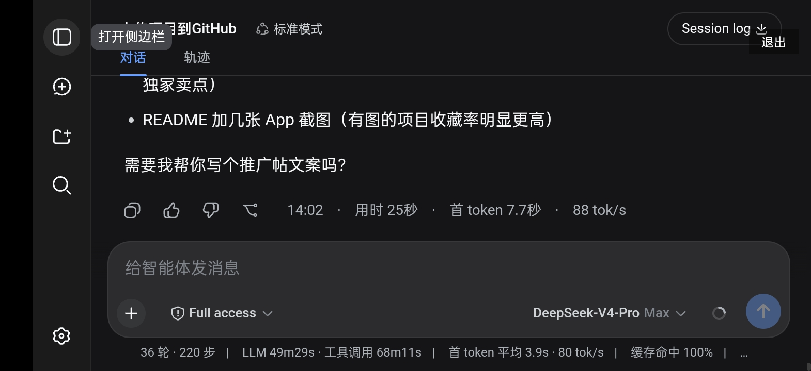 | 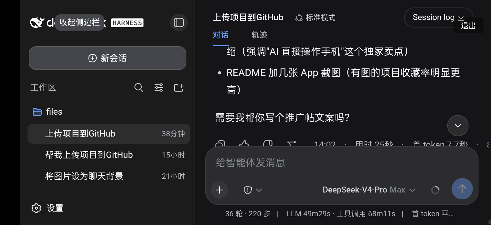 | 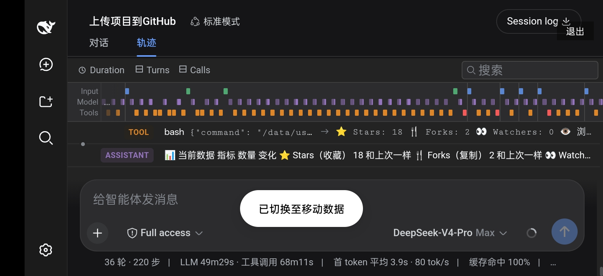 |
| 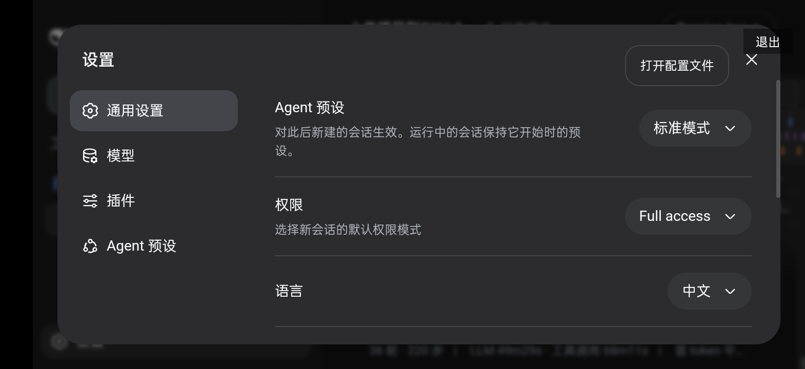 | 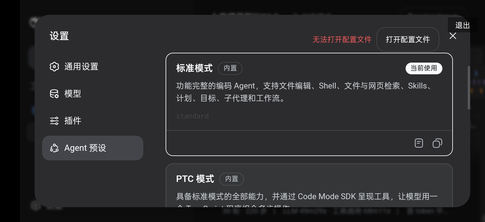 | 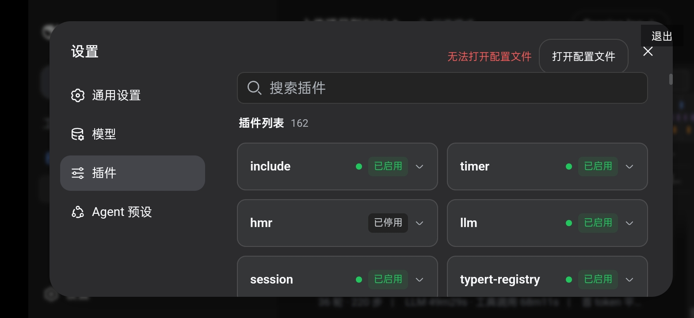 |

**v1.4.0（Lite 共存版）实测截图**：

| | | |
|---|---|---|
| 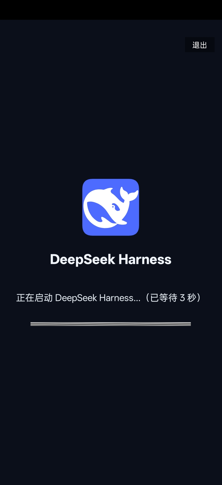 | 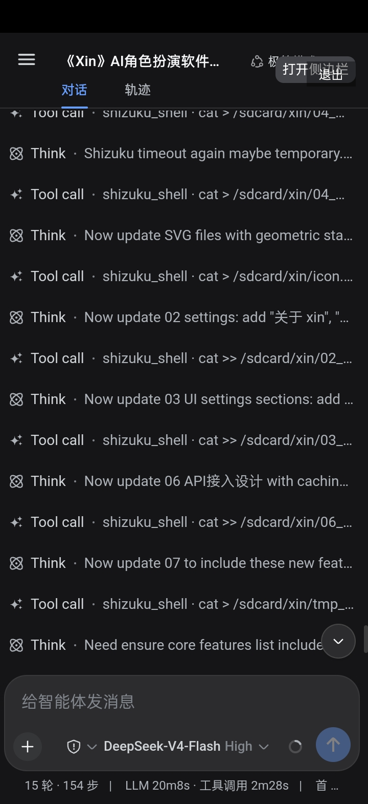 | 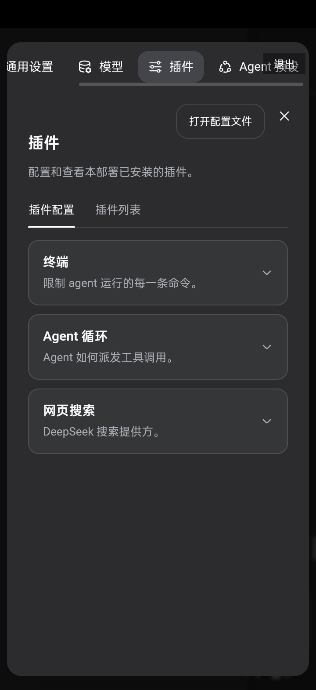 |

## 🛠️ 手机端插件（本项目的核心特色）

| 插件 | 能力 |
|---|---|
| `dsh-tool-shizuku` | 特权 shell：任意系统命令（pm/am/settings/dumpsys…），异步执行 + 环境消毒 + dex 只读自愈 |
| `dsh-tool-android` | 结构化系统操作：包管理 / 应用管理 / 系统设置 / 截图 / 模拟输入 |

> 通过这两个插件，AI 不再只是"聊聊天"，而是能**真正控制你的手机**。

## 📦 安装

下载 [Releases](https://github.com/woaiys3/deepseek-harness-android-app/releases) 里的 APK 安装即可：

- **`DeepSeekHarness.apk`（v1.4.0，推荐）**：正式版，从旧版本同签名升级
- **`DeepSeekHarness-Lite.apk`（v1.4.0-lite）**：**共存版**，包名 `com.deepseek.harness.beta`，与正式版完全独立、可同时安装——适合**不敢直接升级、想先试用**的用户；数据独立在 `/sdcard/DeepSeekHarnessLite/`，API Key 需单独填，测完可随时卸载（不影响正式版）

要求：
- Android 7.0（API 24）及以上
- 系统操作能力需配合 [Shizuku](https://shizuku.rikka.app/)（免 Root 授权）或有 root；**都不授予也能正常使用**（文件操作只需「所有文件访问」权限）
- API Key 在 App 内页面填写，只存本机，绝不打包进 APK

> 🆘 **打不开 / 白屏 / 连接失败？** 先看 [启动排查](docs/启动排查.md)（常见问题都能自助解决）。

## 📁 目录结构

```
CHANGES.md              版本改动记录（含 @Suyi222 贡献的 v1.1.1 稳定基线）

android-app/             APK 构建工程
├── build.sh             一键打包脚本
├── env.sh               编译工具链环境（可 export PREFIX 覆盖）
├── AndroidManifest.xml  包名/targetSdk(28)/横竖屏自由旋转/Shizuku 声明
├── libs/                Shizuku 官方 aar（api/provider/aidl 13.1.5）
├── res/                 图标 + 字符串资源
├── sdk/                 放 platform android.jar（见 sdk/README.md）
└── src/.../MainActivity.java   Android 原生壳（权限引导页/加载页/引擎启动）

mobile-patch/            移动端适配（注入 DSH 前端，不覆盖原生代码）
├── inject.sh            注入脚本（mobile.css + mobile.js 到 dist）
├── mobile.css           触摸优化 + 竖屏适配 + 插件管理页 UI 适配
└── mobile.js            软键盘适配（VisualViewport 方案，横竖屏通用）

plugins/                 手机端自定义 DSH 工具插件
├── dsh-tool-shizuku/    特权 shell（Shizuku 通道）
└── dsh-tool-android/    结构化系统操作（包管理/应用/设置/截图/输入）

dsh-patches/             DSH 源码补丁归档 + overlay
├── README.md            补丁说明（适配原因/升级 DSH/打包）
├── apply.sh             重新应用源码补丁
└── overlay/             改好后的源码文件

config/cordis.patch.yml  DSH 组合配置（禁原生模块 + 插入 bash-local/shizuku/android 插件）

docs/开发指南.md            项目开发指南（架构/常用命令/注意事项）
```

## 🔨 构建说明

详见 `docs/开发指南.md` 第六节「常用命令」与第七节「注意事项」。

关键点：
- `targetSdk` 必须保持 **28**（≥29 会导致 node 二进制 EACCES 起不来）
- 需准备 `runtime/`（node v26 + 依赖库）和 `dshroot/`（DSH 内核）才能打完整 APK
- `build.sh` 会自动注入 mobile.css/mobile.js，并做 API Key 安全检查

> ⚠️ 这是源码与配置仓库，**不含 APK 二进制、签名密钥（release.jks）、node 运行时、payload.zip、凭证文件**。
> 📦 安装包（DeepSeekHarness.apk）、node 运行时与 DSH 内核分块包见 [Releases](https://github.com/woaiys3/deepseek-harness-android-app/releases)；构建源码前需准备 runtime/ 与 dshroot/（分块包合并方法见 Release 说明）。

## 💬 交流讨论

遇到问题、想提建议、或想交流用法？欢迎加入 QQ 群 / QQ 频道：

| QQ 群 | QQ 频道 |
|---|---|
| 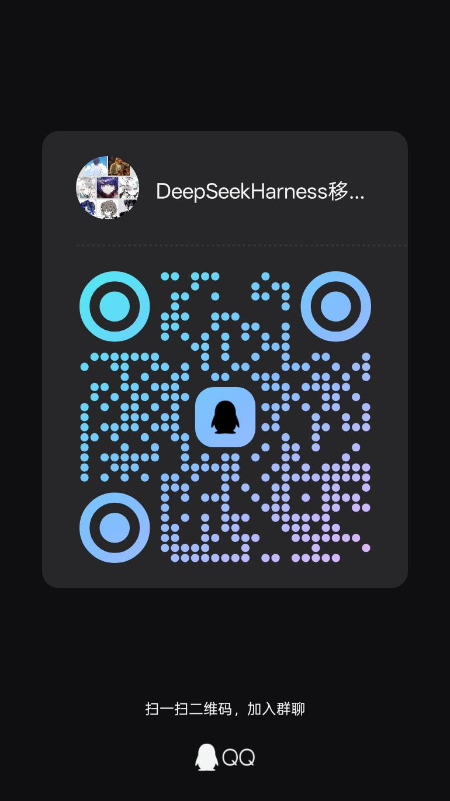 | 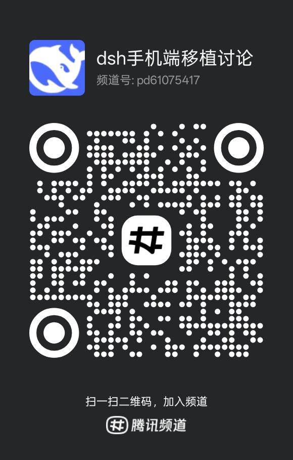 |

> 也可以直接在 [Issues](https://github.com/woaiys3/deepseek-harness-android-app/issues) 反馈，我会尽快回复。

## 📄 许可证

本项目源码采用 [MIT](LICENSE) 许可证。

- 依赖的 DSH 内核（@deepseek-ai/dsh）为 MIT；Shizuku SDK 为 Apache-2.0；node 运行时为 MIT。
- 仓库不含签名密钥与凭证；安装包与运行时见 [Releases](https://github.com/woaiys3/deepseek-harness-android-app/releases)。
